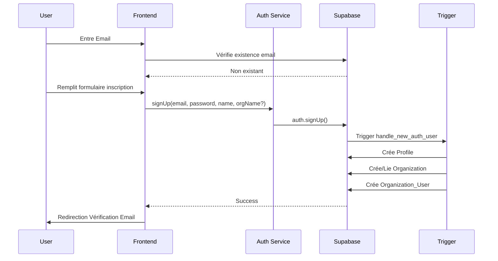
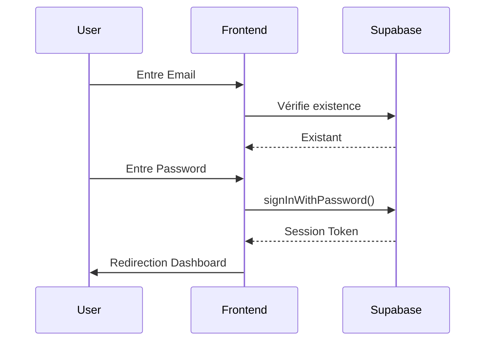

# Intégration Supabase - Système d'Authentification et de Gestion des Organisations

## Structure de la Base de Données

### Tables Principales
```sql
-- Organizations : Gère les organisations principales et sous-organisations
CREATE TABLE organizations (
    id UUID PRIMARY KEY DEFAULT gen_random_uuid(),
    name TEXT NOT NULL,
    user_account_type TEXT NOT NULL CHECK (user_account_type IN ('individual', 'business')),
    parent_organization_id UUID REFERENCES organizations(id),
    subscription_tier TEXT DEFAULT 'free',
    subscription_status TEXT DEFAULT 'trialing',
    settings JSONB DEFAULT '{}',
    metadata JSONB DEFAULT '{}',
    created_at TIMESTAMPTZ DEFAULT now(),
    updated_at TIMESTAMPTZ DEFAULT now()
);

-- Profiles : Extension de auth.users pour les données utilisateur
CREATE TABLE profiles (
    id UUID PRIMARY KEY REFERENCES auth.users(id) ON DELETE CASCADE,
    email TEXT UNIQUE,
    name TEXT,
    avatar_url TEXT,
    metadata JSONB DEFAULT '{}',
    created_at TIMESTAMPTZ DEFAULT now(),
    updated_at TIMESTAMPTZ DEFAULT now()
);

-- Roles : Définition des rôles et permissions
CREATE TABLE roles (
    id UUID PRIMARY KEY DEFAULT gen_random_uuid(),
    name TEXT NOT NULL,
    type role_type NOT NULL DEFAULT 'system',
    permissions JSONB NOT NULL DEFAULT '{}',
    organization_id UUID,
    created_at TIMESTAMPTZ DEFAULT now(),
    UNIQUE(name, organization_id)
);

-- Organization_Users : Liaison entre utilisateurs et organisations
CREATE TABLE organization_users (
    id UUID PRIMARY KEY DEFAULT gen_random_uuid(),
    organization_id UUID NOT NULL REFERENCES organizations(id),
    user_id UUID NOT NULL REFERENCES auth.users(id),
    role_id UUID NOT NULL REFERENCES roles(id),
    status user_status NOT NULL DEFAULT 'pending',
    metadata JSONB DEFAULT '{}',
    created_at TIMESTAMPTZ DEFAULT now(),
    updated_at TIMESTAMPTZ DEFAULT now(),
    UNIQUE(organization_id, user_id)
);
```

## Flow d'Authentification

### 1. Inscription (SignUp)


### 2. Connexion (SignIn)


## Hiérarchie des Rôles et Organisations

### Types d'Organisation
1. **Individual**
   - Créée automatiquement pour les utilisateurs individuels
   - L'utilisateur est Super Admin de son compte

2. **Business**
   - Organisation principale pour les entreprises
   - Peut avoir des sous-organisations (subsidiaries)
   - Hiérarchie de rôles complète

### Rôles et Permissions
```typescript
type Permissions = {
    user_management: boolean
    organization_management: boolean
    test_management: boolean
    subsidiary_management: boolean
    all_subsidiaries_access: boolean
}

const RoleHierarchy = {
    'Super Admin': [...toutes les permissions],
    'Admin': ['user_management', 'test_management'],
    'User': ['test_management'],
    'Viewer': []
}
```

## Structure des Services et Hooks

### Services
1. **AuthService** (`lib/services/auth-service.ts`)
   - Gère inscription/connexion
   - Synchronisation avec profiles
   - Gestion des organisations

2. **OrganizationService** (`lib/services/organization-service.ts`)
   - CRUD organisations
   - Gestion des utilisateurs
   - Statistiques utilisateurs

### Hooks
1. **useAuth** (`hooks/useAuth.ts`)
   - Gestion session utilisateur
   - État de connexion
   - Redirection automatique

2. **useOrganization** (`hooks/useOrganization.ts`)
   - Contexte organisation courante
   - Accès données organisation

3. **usePermissions** (`hooks/usePermissions.ts`)
   - Vérification permissions
   - Contrôle accès fonctionnalités

## Automatisations Supabase

### Triggers
```sql
-- Création automatique profil utilisateur
CREATE TRIGGER on_auth_user_created
    AFTER INSERT ON auth.users
    FOR EACH ROW
    EXECUTE FUNCTION handle_new_auth_user();

-- Synchronisation profil/auth
CREATE TRIGGER on_profile_updated
    AFTER UPDATE ON profiles
    FOR EACH ROW
    EXECUTE FUNCTION sync_user_details();
```

### Policies
```sql
-- Lecture profil personnel
CREATE POLICY "Users can read their own profile"
    ON profiles FOR SELECT
    USING (auth.uid() = id);

-- Lecture utilisateurs même organisation
CREATE POLICY "Users can view their organization's users"
    ON organization_users FOR SELECT
    USING (organization_id IN (
        SELECT organization_id 
        FROM organization_users 
        WHERE user_id = auth.uid()
    ));
```

## Fichiers Principaux
```
├── components/
│   ├── auth/
│   │   ├── authentification.tsx    # Composant authentification
│   │   └── require-permission.tsx  # HOC contrôle accès
│   └── organization/
│       ├── users-list.tsx         # Liste utilisateurs
│       └── users-stats.tsx        # Statistiques utilisateurs
├── hooks/
│   ├── useAuth.ts
│   ├── useOrganization.ts
│   └── usePermissions.ts
├── lib/
│   └── services/
│       ├── auth-service.ts
│       └── organization-service.ts
└── app/
    └── (protected)/
        └── settings/
            └── organization/
                └── page.tsx       # Page gestion organisation
```
